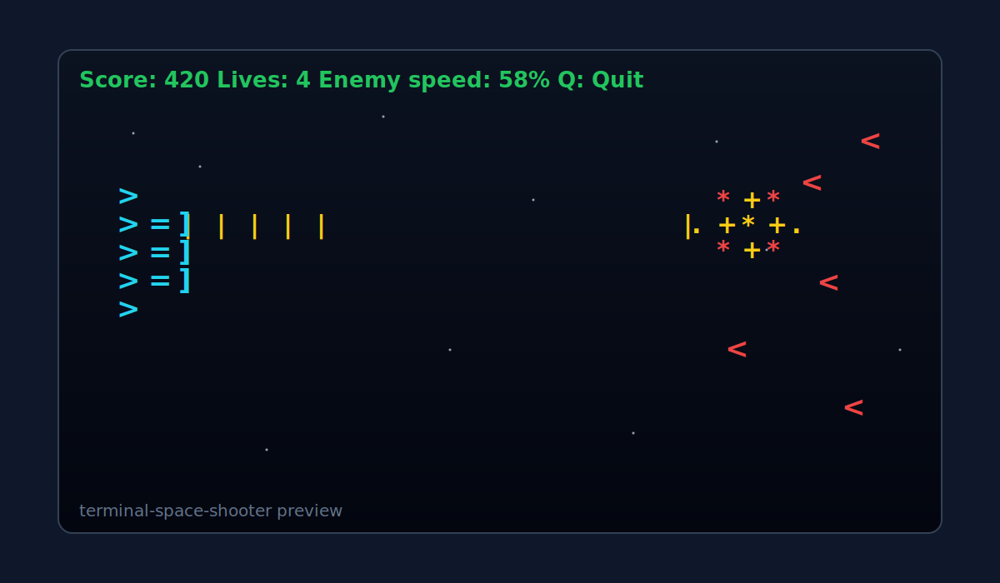

# Terminal Space Shooter

A fast, side-scrolling terminal shooter built with Python `curses`.

## Features

- Shooter anchored on the left, enemies fly in from the right
- Three enemy classes with different shapes, health, scores, movement speeds, hit sounds, and explosion styles
- Three switchable gun types with distinct firing patterns: rapid, spread, and cannon
- Real-time enemy speed control
- Colorized HUD, ship, bullets, enemies, and hit effects
- Sound effects for weapon changes, shooting, hits, damage, and game over

## Controls

- `W` / `S` or `Up` / `Down`: Move ship
- `Space`: Fire current gun
- `Left` / `Right`: Switch guns
- `-`: Decrease enemy speed
- `+` or `=`: Increase enemy speed
- `P`: Pause / resume
- `Q`: Quit

## Enemy Types

- `Scout` `<`: fast, weak, low score
- `Spinner` `@`: fast, medium health, medium score
- `Brute` `#`: slow, tanky, high score

## Guns

- `Rapid`: very fast single shots
- `Spread`: wide five-lane burst
- `Cannon`: slower heavy shots with higher damage

## Run

```bash
python3 space_shooter.py
```

## Screenshot

Updated preview showing a more realistic in-terminal battle scene:


